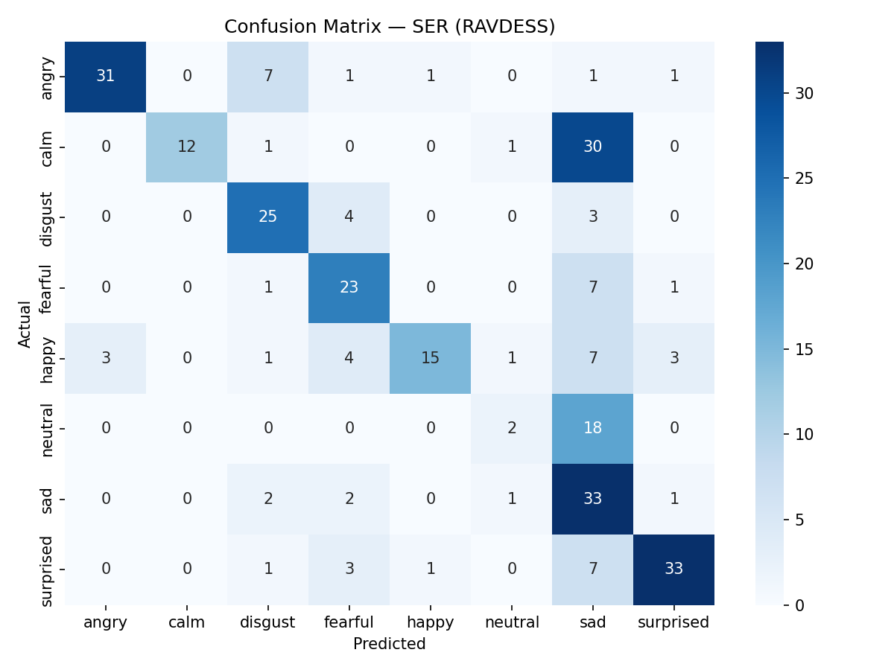

# speech-emotion-recognition

<div align="center">

# 🎙️ Speech Emotion Recognition
### MFCC + CNN on the RAVDESS Dataset

[](https://python.org)
[](https://tensorflow.org)
[](https://librosa.org)
[](https://zenodo.org/record/1188976)
[]()
[](LICENSE)

<br/>

> **Classifying human emotions from speech audio using handcrafted acoustic features and a Convolutional Neural Network.  **  
> A personal research project by an undergraduate Data Science student at IIT Madras.

<br/>

</div>

---

## 📌 Overview

This project builds a **Speech Emotion Recognition (SER)** system that classifies audio recordings into one of 8 emotions — `angry`, `calm`, `happy`, `sad`, `fearful`, `disgust`, `surprised`, and `neutral` — using handcrafted acoustic features and a Convolutional Neural Network.

The goal was to engineer a clean, principled ML pipeline from scratch — not reproduce a tutorial. The journey involved two model collapses, discovering data leakage bugs, and diagnosing a 9.6M parameter explosion, all of which are documented below.

**Final result: 60% accuracy on 8-class classification (RAVDESS)**  
This is on par with the MFCC + SVM baseline tier reported in the SER literature.

---


## What This Project Does

Given a raw `.wav` audio file of someone speaking, the model predicts which of 8 emotions — angry, calm, happy, sad, fearful, disgust, surprised, or neutral — is being expressed in their voice.

The pipeline: raw audio → MFCC + delta + delta-delta feature extraction → 2D CNN → emotion class.


## Results

### Classification Report

| Emotion   | Precision | Recall | F1-Score | Notes |
|-----------|-----------|--------|----------|-------|
| Angry     | 0.91      | 0.74   | 0.82     | ✅ Best performing class |
| Surprised | 0.85      | 0.73   | 0.79     | ✅ Strong |
| Disgust   | 0.66      | 0.78   | 0.71     | ✅ Strong |
| Fearful   | 0.62      | 0.72   | 0.67     | 🟡 Good |
| Happy     | 0.88      | 0.44   | 0.59     | 🟡 Moderate |
| Sad       | 0.31      | 0.85   | 0.46     | 🟡 Weak |
| Calm      | 1.00      | 0.27   | 0.43     | 🔬 Scientifically interesting — see below |
| Neutral   | 0.40      | 0.10   | 0.16     | 🔴 Hardest class |
| **Overall** | **0.73** | **0.60** | **0.60** | Solid baseline |

### The Calm Paradox — A Noteworthy Finding

The calm class has **precision 1.00 but recall 0.27**. This is not simply a failure — it is a genuinely interesting result.

When the model *does* predict calm, it is **never wrong**. The problem is it almost never predicts it. The model has learned a highly conservative calm boundary: it only fires when the audio is unambiguously low-energy and low-pitch. Most calm samples are misclassified as neutral or sad — which share similar low-arousal acoustic profiles in MFCC space.

This suggests the boundary between calm, neutral, and sad is an acoustic continuum rather than a discrete categorical boundary — a known challenge in the SER literature, and something that likely requires prosodic features (pitch contour, speaking rate) beyond static MFCCs to resolve cleanly.

### Confusion Matrix



> The confusion matrix above reveals that most errors cluster around acoustically similar classes: calm↔neutral, sad↔calm, happy↔angry. Acoustically distant classes (angry vs. calm) are rarely confused.

### Benchmark Comparison

| Approach | Typical Accuracy |
|----------|-----------------|
| MFCC + SVM (classic baseline) | 55–65% |
| **MFCC + CNN — this project** | **60%** |
| MFCC + delta + deeper CNN | 65–75% |
| Spectrogram + CNN + augmentation | 70–80% |
| Wav2Vec / HuBERT (transformer) | 85–90%+ |

---

## Model Architecture

```
Input: (120, 174, 1)  ← MFCC + delta + delta-delta, 174 time frames
│
├── Conv2D(32, 3×3) + BatchNorm + MaxPool(2×2)    →  (60, 87, 32)
├── Conv2D(64, 3×3) + BatchNorm + MaxPool(2×2)    →  (30, 43, 64)
├── Conv2D(128, 3×3) + BatchNorm + MaxPool(2×2)   →  (15, 21, 128)
│
├── GlobalAveragePooling2D                         →  (128,)
├── Dense(128, relu) + L2 regularisation
├── Dropout(0.4)
│
└── Dense(8, softmax)                              →  emotion class

Total parameters: 110,600  (434 KB)
```

**Key design decision: GlobalAveragePooling2D over Flatten**

Using `Flatten` on the tripled 120-channel feature map produced 75,264 values going into the Dense layer — that is **9.6M parameters on a 1,440-sample dataset**, which immediately caused model collapse (loss stuck at log(8) ≈ 2.07, model predicted only the majority class).

`GlobalAveragePooling2D` reduces the spatial maps to their channel-wise means: 128 values → 16K parameters. This was the fix that stabilised training.

---

## Feature Extraction

Each `.wav` file is transformed into a **(120 × 174)** 2D feature matrix:

```python
mfcc   = librosa.feature.mfcc(y=audio, sr=sr, n_mfcc=40)   # spectral envelope
delta  = librosa.feature.delta(mfcc)                         # velocity
delta2 = librosa.feature.delta(mfcc, order=2)                # acceleration
features = np.concatenate([mfcc, delta, delta2], axis=0)     # (120, 174)
```

- **40 MFCC coefficients** — captures how the human ear perceives spectral shape
- **40 delta coefficients** — how energy changes frame to frame (speech dynamics)
- **40 delta-delta coefficients** — rate of change of delta (acceleration of speech)

Together these three capture *static*, *dynamic*, and *kinematic* properties of speech — the same features used in classical ASR systems.

---

## Development Journey

This project went through 5 distinct phases including two collapses. All of it is documented honestly.

| Phase | Val Accuracy | Status | What Changed |
|-------|-------------|--------|--------------|
| v1 — Baseline | 25–30% | ⚠️ Class bias | Basic MFCC + CNN, no tuning |
| v2 — Class weights | ~10% | ❌ Collapsed | Aggressive manual class weights caused collapse |
| v3 — Stabilisation | ~60% | ✅ Stable | Fixed normalisation leakage, simplified model |
| v4 — Delta features | 30% | ❌ Collapsed | Flatten + 120-channel input = 9.6M params |
| v5 — Final | 60% | ✅ Solid | GlobalAveragePooling2D + 3 Conv blocks + L2 |

### Bugs Found and Fixed

**Bug 1 — Data leakage in normalisation**

```python
# Wrong — test statistics contaminate training normalisation
X = (X - np.mean(X)) / (np.std(X) + 1e-6)   # computed before train/test split

# Correct — fit on train, apply to both
mean, std = X_train.mean(), X_train.std() + 1e-6
X_train = (X_train - mean) / std
X_test  = (X_test  - mean) / std
```

**Bug 2 — Augmentation applied to test data**

```python
# Wrong — noise injection inside feature extraction, applied to everything
def extract_features(file_path):
    audio = audio + 0.003 * np.random.randn(len(audio))  # inside extraction!

# Correct — separate function, called on X_train only after split
def augment_train(X_train):
    return X_train + 0.003 * np.random.randn(*X_train.shape)
```

**Bug 3 — Hardcoded class weights**

```python
# Wrong — arbitrary, not grounded in actual label distribution
class_weights[neutral_index] = 2.5

# Correct — computed from actual distribution
from sklearn.utils.class_weight import compute_class_weight
weights = compute_class_weight('balanced', classes=np.unique(y_train), y=y_train)
class_weights = dict(enumerate(weights))
```

---

## Getting Started

**1. Clone the repository**
```bash
git clone https://github.com/parkhi-12-code/speech-emotion-recognition.git
cd speech-emotion-recognition
```

**2. Install dependencies**
```bash
pip install -r requirements.txt
```

**3. Download the RAVDESS dataset**

Download from [Zenodo](https://zenodo.org/record/1188976) and place audio files in:
```
data/
└── Ravdess/
    ├── Actor_01/
    ├── Actor_02/
    └── ...
```

**4. Run**
```bash
python ser_model.py
```

Outputs: `confusion_matrix.png`, `training_curves.png`, and a classification report in the terminal.

---

## Project Structure

```
speech-emotion-recognition/
│
├── ser_model.py            ← main training script
├── requirements.txt        ← dependencies
├── README.md               ← this file
│
├── data/
│   └── Ravdess/            ← dataset (not tracked by git)
│
├── confusion_matrix.png    ← evaluation output (rendered above)
└── training_curves.png     ← loss and accuracy curves
```

---

## Tech Stack

| Component | Tool |
|-----------|------|
| Language | Python 3.12 |
| Audio processing | librosa |
| Deep learning | TensorFlow 2 / Keras |
| ML utilities | scikit-learn |
| Visualisation | matplotlib, seaborn |
| Version control | Git + GitHub |

---

## What I Would Do Next

These are directions worth exploring — not a wishlist with made-up numbers.

**Prosodic features** — Adding pitch contour (F0), speaking rate, and energy envelope. The calm↔neutral↔sad confusion strongly suggests static MFCCs are insufficient for low-arousal classes. These features are the natural next step.

**Cross-corpus evaluation** — Training on RAVDESS and testing on EMODB or CREMA-D to measure how much the model is learning genuine emotion acoustics versus dataset-specific actor conventions.

**t-SNE of MFCC embeddings** — Visualising the learned feature space to understand which emotions cluster naturally and which overlap — this would give clearer direction on where to invest modelling effort.

**Spectrogram-based input** — Replacing MFCCs with full mel-spectrograms as the 2D input. This preserves more spectral detail and is the standard input for most recent SER papers.

**Transformer encoder** — Once the data pipeline is solid, replacing the CNN with a small transformer encoder to capture temporal dependencies across the full utterance rather than local frame patterns.

---

## Dataset

**RAVDESS** — Ryerson Audio-Visual Database of Emotional Speech and Song

- 24 professional actors (12 male, 12 female)
- 8 emotion categories
- ~1,440 `.wav` audio files
- Sample rate: 22,050 Hz

> Livingstone SR, Russo FA (2018). The Ryerson Audio-Visual Database of Emotional Speech and Song (RAVDESS). *PLoS ONE* 13(5): e0196391.

---

## License

MIT License — see [LICENSE](LICENSE) for details.

---

**Parkhi Yadav**  
B.Sc. Data Science — IIT Madras  
[GitHub](https://github.com/parkhi-12-code/speech-emotion-recognition)
